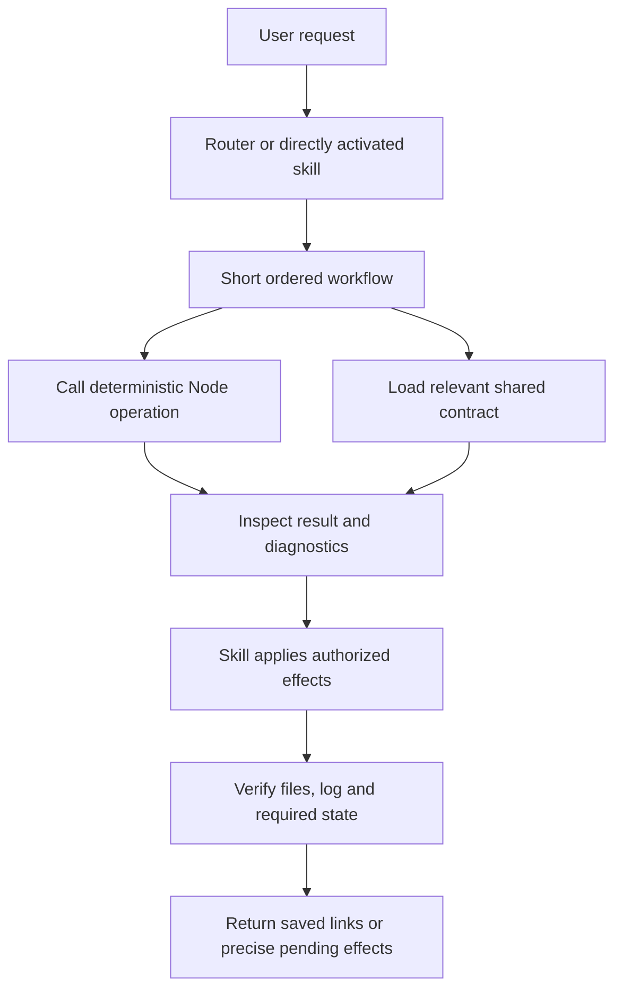

# Daily Tasks Tessl Guidance Improvements - Plan

## Goal Capsule

**Objective:** Users' Daily Tasks requests reliably reach the right workflow and produce the intended saved records or plans without avoidable clarification or contradictory instructions.

**Means:** Refine the existing six skills, consolidate shared guidance, correct the two documented contract errors, and evaluate the resulting bundle using Tessl's composition and optimization guidance.

**Authority:** The current user request and `AGENTS.md` govern this work; `docs/requirements.md` and the existing canonical skills define preserved product behavior. Tessl review suggestions are evidence to assess against those constraints.

**Execution boundary:** This document authorizes a plan, not implementation or publication. A subsequent implementation run owns source changes and verification. No release, registry publication, personal-record migration or external messaging is part of this plan.

## Product Contract

### Summary

Improve discovery and procedural clarity while retaining the existing plugin architecture. Finish the composition changes first, then run a separately reported evaluation phase covering natural activation, task performance and the supported host.

### Problem Frame

The 2026-10-09 review of version 0.3.3 at commit `d20b74b2ff5d85e064bea890c89e9fe9cf6b057e` found four descriptions without explicit usage triggers and a dense planning procedure whose sequence is difficult to follow. Shared guidance has drifted: the planning flow says five columns while the template has six, and the CLI table omits hashes required by `planning-state`.

Tessl's `default-skill-review@0.2.0` returned Router 82, Setup 79, Records 79, Capture 75, Check-in 75 and Plan 68 out of 100. All six passed structural validation with a relative-link warning. The local audit passed 105 tests and found no broken Markdown file links or orphaned support files. Those checks establish neither natural skill activation nor native-host acceptance; `evals/LATEST.md` still marks Codex workflow-v3 unverified.

The reviewer treated sibling references as missing from individual uploads and incorrectly called `workspace-migration.md` orphaned. Those findings do not justify duplicating references or removing migration guidance.

Product Contract preservation: no change to the existing product's acceptance, state, storage or scheduling semantics. This plan's R-IDs describe the instruction improvement work; existing product requirements remain in `docs/requirements.md`.

The older R2 wording in `docs/requirements.md` says that requests do not count as acceptance. The canonical router at `skills/daily-tasks/SKILL.md` and Capture at `skills/daily-tasks-capture/SKILL.md` distinguish quoted/source requests from a user's explicit instruction to create named work. Preserve that distinction; U1 clarifies the older wording to match the existing behavior.

### Requirements

**Instruction quality**

- R1. Each skill description states what it does and when to use it, with distinct natural-language triggers and supported scope boundaries.
- R2. Daily planning has an ordered entry procedure with explicit read, recovery, reconciliation, write and verification checkpoints.
- R3. Each shared protocol has one authoritative reference; links state when to load it, and every shipped support file is reachable from its workflow.
- R4. The CLI summary states all required `planning-state` inputs, and every planning-screen instruction agrees on the six existing columns.

**Preservation and evidence**

- R5. Preserve explicit acceptance, direct named creation as acceptance, independent vault bindings, user ownership authority, script-only logs, optimistic checks, recovery, closure rules and request-triggered maintenance. Preserve the prohibition on automatic scheduling, time fitting and implicit acceptance.
- R6. Keep `skills/` canonical and host artifacts generated; shipped sibling skills, references and runtime files must remain intact.
- R7. Report instruction quality, natural activation, task performance and native-host acceptance separately, retaining failures and limitations rather than converting them into passes.

### Scope Boundaries

This is a content and packaging-verification refactor. Runtime algorithms, CLI behavior, record schemas and saved user data are unchanged.

Considered and not added: always-on product rules, new slash commands, lifecycle hooks, an MCP server, additional skills, a custom reviewer and a new evaluation framework. None is required to resolve the verified findings. Reconsider a component only when a concrete user capability or measured failure requires it.

Tessl registry publication and additional host support are separate follow-up work. Existing optional hosts remain honestly unverified unless exercised.

## Planning Contract

### Tessl's five component types

| Type | Tessl purpose | Decision for Daily Tasks | Reason |
| --- | --- | --- | --- |
| Skill | Model selects a workflow for a relevant request | Retain Router, Setup, Capture, Records, Plan and Check-in | They already divide one task-management responsibility into distinct workflows. |
| Rule | Agent always obeys a convention without prompting | Add no always-on product rule | These conventions apply during Daily Tasks use. Loading them globally would affect unrelated work; `AGENTS.md` already governs repository development. |
| Command | User explicitly invokes a named action, normally a slash command | Add no command component | Natural-language skill entry already serves these actions. `bin/daily-tasks.mjs` is executable support, not a Tessl Markdown command. |
| Hook | Deterministic action at an agent lifecycle event | Add no hook | Maintenance occurs on requested use, not startup, elapsed time or every prompt. Keep validators explicitly called by workflows and build checks. |
| MCP server | Supplies live tools or data unavailable to the agent | Add no MCP server | The existing Node CLI and filesystem provide the required capabilities without another service or transport. |

Tessl's instruction is to select the smallest useful composition, not to instantiate all five types. References, templates and executable assets support skills; they are not additional primitive types.

### Key Technical Decisions

- KTD1. **Keep the six skill names and shared bundle.** Improve their boundaries instead of renaming skills or creating new activation targets. Capture proposes candidates; Records creates explicitly requested or accepted work; Plan handles day selections; Check-in reconciles progress and manual edits. The router composes these routes when needed. Governs R1, R6.
- KTD2. **Separate short procedures from shared contracts.** Keep critical checkpoints at the point of action and link to detailed protocols. Do not move safeguards solely into an always-on rule or rely on the router having been loaded before a directly activated child skill. Governs R2, R3, R5.
- KTD3. **Preserve semantics while removing duplication.** Map each moved instruction to its destination before deleting the old copy. Keep references in the existing shared directory and load them conditionally; do not satisfy an isolated-upload warning by copying them into every child skill. Governs R3, R5.
- KTD4. **Separate evaluation packaging from product packaging.** Use a disposable Tessl-compatible wrapper under `.temp/tessl-eval/`, with `.tessl-plugin/plugin.json`, the complete skill tree and executable dependencies. Keep the existing root `plugin.json` and host manifests in their current formats. This wrapper is evaluation infrastructure and creates no new installation or publication promise. Governs R6, R7.

### Ownership of shared instructions

| Concern | Authoritative file after cleanup |
| --- | --- |
| Route selection and response summary | `skills/daily-tasks/SKILL.md` |
| Configuration discovery and first-use questions | `skills/daily-tasks-setup/SKILL.md` |
| Record identity, metadata, lifecycle and workspace layout | `skills/daily-tasks/references/records.md` |
| Consequential writes, baselines and recovery | `skills/daily-tasks/references/operations.md` |
| Inventory, maintenance gate, rollover and future selections | `skills/daily-tasks/references/planning-flow.md` |
| Numbered replies, status meanings and screen interaction | `skills/daily-tasks/references/response-conventions.md` |
| Executable invocation and operation inputs | `skills/daily-tasks/references/cli.md` |
| Visible default layout and placeholders | `skills/daily-tasks/assets/*.md` |
| User template adaptation and explicit legacy conversion | Existing `templates.md` and `workspace-migration.md` references |

Template comments retain instructions needed to render that template. Move repeated transaction, selection and recovery policy into its owning reference, preserving clear links. Custom-template precedence, ownership-only review filtering and the saved plan's personal/delegated split remain unchanged.

### High-Level Technical Design

## Implementation Units

### U1. Clarify discovery and preserve route boundaries

**Goal:** Users' wording selects the appropriate workflow. **Requirements:** R1, R5. **Dependencies:** None.

**Files:** The six `skills/*/SKILL.md` files; `docs/requirements.md` R2 for the acceptance clarification above; `README.md` for a brief composition explanation; new `evals/tessl/activation-cases.md` as a human-readable test specification.

**Approach:** Add explicit usage triggers to Capture, Check-in, Plan and Records, using the reviewed wording as a starting point. Retain Setup's already-valid equivalent trigger and the router's scope boundary. Include everyday phrases such as “action items,” “plan my day,” “mark done” and “reassign”; avoid reminder/calendar claims. Document sibling dependencies without forcing redundant setup or acceptance prompts. Clarify the older product R2 wording using the router/Capture distinction; keep quoted requests, inferred promises and manual new checkboxes outside acceptance.

**Test scenarios:** Cover all six entry routes, direct child-skill activation, a quoted third-party request becoming a candidate, a direct named create request proceeding without reacceptance, and unrelated planning requests that should not activate Daily Tasks. Include ambiguous bare row numbers and mixed requests requiring a route handoff.

**Verification:** Manual description review establishes distinct what/when coverage; downstream activation runs use the cases in U4. No new unit tests for wording alone.

### U2. Reorganize planning and consolidate shared guidance

**Goal:** The agent can follow routine planning without assembling its sequence from scattered policy. **Requirements:** R2, R3, R5. **Dependencies:** U1.

**Files:** `skills/daily-tasks-plan/SKILL.md`, `skills/daily-tasks-setup/SKILL.md`, `skills/daily-tasks-checkin/SKILL.md`, the shared `planning-flow.md`, `operations.md`, `response-conventions.md`, and the planning/daily-plan assets. Touch other skill links only when their destinations change.

**Approach:**

1. Organize Plan as resolve/prepare, recover/reconcile, verify rollover, render/save review mapping, apply explicit decisions, then verify/report. Reprepare when reconciliation or another write invalidates packet hashes.
2. Preserve the changed-rollover Markdown transaction and the distinct no-change `planning-state` receipt path. An existing plan never substitutes for verified rollover.
3. Keep canonical task and required parent/project effects ahead of daily-plan projections. Persist mappings before waiting for numbered replies; retain failed-operation checkpoints.
4. Consolidate Setup's repeated scope guidance and template policy using the ownership table. Replace broad mandatory reference reads with purpose-specific reads where all required instructions remain reachable.

**Test scenarios:** Review same-day no-change planning, a pre-created future plan receiving carry once, interrupted future selection, a stale numbered mapping, a status change that does not select work, a conflicting edit that suspends only the affected item, and custom templates. Compare direct child-skill runs with router-led runs.

**Verification:** Review a before/after instruction map under `.temp/` to prove that each removed safeguard survives at its owner and is loaded before dependent work. Word/read counts are diagnostic only; no deletion quota or claimed latency gain. Existing `test/planning.test.mjs`, `test/recovery-flow.test.mjs` and `test/context.test.mjs` remain relevant regression evidence.

### U3. Correct the two contract errors and regenerate artifacts

**Goal:** Instructions agree with implementation and templates. **Requirements:** R4, R6. **Dependencies:** U2.

**Files:** `skills/daily-tasks/references/cli.md`, `skills/daily-tasks/references/planning-flow.md`, generated host manifests/artifacts, and only any stale derivative documentation discovered by a bounded search. Inspect `lib/planning/session.mjs`; do not change its behavior.

**Approach:** Add `expectedInventoryHash` for both `planning-state` actions and `expectedReviewHash` for `save-review`, with the preparation packet's `context.now` and matching page/allMilestones options. Add one complete shared input example using values from an actual preparation packet rather than invented hashes. Correct five columns to six: #, Status, Project, Milestone, Task, Due Date.

**Test scenarios:** In a synthetic vault, documented inputs save a valid review or eligible no-change receipt; a changed source still rejects the stale packet. Confirm the six-column rendering and custom-template precedence. Reuse existing planning-state behavior tests; do not add tests that merely match prose strings.

**Verification:** Regenerate with `node scripts/assemble.mjs write`, then run `npm run check` and `node --test`. Validate new example syntax, command flags, links and complete generated file membership. Preserve the source-only edit boundary.

### U4. Measure the finished composition and close the evidence gap

**Goal:** Establish whether the changes improve routing and execution. **Requirements:** R7, with R1–R6 as preserved constraints. **Dependencies:** U3; this is the separate evaluation phase after composition is complete.

**Files:** New `evals/tessl/README.md` and scenario directories; existing `evals/README.md`, `evals/matrix.json` and `evals/LATEST.md` only through their established evidence workflow; new dated public review summary under `docs/`. Temporary packages and scratch remain under `.temp/`.

**Approach:**

1. Preserve the old instruction-review receipts and source identity. Stage the original commit and the revised bundle separately, without changing the working checkout; use the same synthetic fixtures, model and judge configuration for comparisons.
2. Scaffold the disposable Tessl wrapper using the installed CLI's documented `plugin new` form and explicit `nyssa-ai` workspace. Copy all six skills and supporting files; never run `skill new` within it. Inspect current packaging support before declaring runtime files included.
3. Lint and pack the wrapper, inspect every intended archive member, and verify its CLI from an unrelated working directory. Missing runtime files or an unusable sandbox are evaluation blockers, not instruction failures; retain the failed attempt and fix the wrapper before scoring.
4. Run natural activation before content evaluation. Evaluate U1's positive, negative and ambiguous requests. Assess the selected workflow/handoff, not the number of skills fired.
5. Run 3–5 discriminating content scenarios with one supported agent: configuration/direct acceptance; candidate deduplication; rollover/selection; interrupted recovery/reconciliation; and closure/reopening. Compare no-plugin baseline, original context and revised context. Reuse the existing synthetic recovery fixture rather than invent another writer.
6. Run the eight existing workflow-v3 native-host acceptance scenarios on the supported Windows Codex host. Keep phone continuity and optional hosts separately reported; a cloud Tessl result cannot prove either.

**Verification:** Use labels on every Tessl eval run and record source hashes, actual agent/model, scenario version, run IDs and per-criterion results. Keep every scenario prompt free of hidden answer hints; judge observable outcomes and give no points solely for loading a skill. Do not overwrite or convert the repository's existing deterministic eval format into Tessl's format.

## Verification Contract

| Evidence | Method | Acceptance |
| --- | --- | --- |
| Canonical structure | `npm run check` after assembly; Markdown link/reachability audit | All intended skills, references, templates and runtime files ship; no orphan introduced. |
| Runtime regression | `node --test` | Existing behavior checks pass; prior 105-test count is a baseline, not an immutable target. |
| Instruction quality | `tessl review run skills/<name> --workspace nyssa-ai --label verify --json` for each skill | Report actual dimension deltas; resolve valid findings and explain remaining isolated-bundle warnings. Aim for 85+, without padding or weakening product rules to reach it. |
| Tessl package | `tessl plugin lint <staged-plugin>` and `tessl plugin pack <staged-plugin> --output <scratch-archive>`; archive inspection | Every required file is present and executable dependencies resolve. Never treat the existing non-Tessl root manifest as a Tessl manifest. |
| Security review | Installed `tessl review run security --help`, followed by its supported review form with explicit workspace | Triage actual findings because the bundle executes code and accesses files; document which files were reviewed. |
| Activation | Installed `tessl eval run --help`; natural-activation mode with forced activation and scoring disabled | Review each expected route and justified non-activation; no invented aggregate activation pass percentage. |
| Content performance | Same-scenario baseline/original/revised runs | Target revised-context average at least 85% with no regressions; any acceptance, scope, logging or recovery violation fails regardless of average. |
| Native acceptance | Existing eight workflow-v3 scenarios and `evals/report.mjs` checks | Current, hash-verified evidence for required rows; missing host access remains explicitly Not run. |

Choose an available agent from the installed CLI's supported list at execution time and keep it fixed across the comparison. Inspect help before using version-sensitive flags. Start with a small discriminating suite; refine scenarios that baseline solves trivially before expanding model coverage.

After evaluation, prioritize regressions, diagnose their instruction owner, make targeted corrections and rerun affected scenarios. Limit optimization to two improvement iterations as Tessl advises, then report unresolved criteria. That iteration limit is a reporting stop, not permission to mark failed acceptance complete.

## Definition of Done

- U1: Trigger descriptions and routing cases distinguish all six workflows without narrowing direct accepted creation.
- U2: The planning sequence is explicit, shared rules have a clear owner, and the instruction map preserves each consequential safeguard.
- U3: Both documented errors are corrected; generated artifacts and appropriate local checks pass.
- U4: Quality, activation, comparative performance and current native-host evidence are separately reported, with no unexplained regression or false pass.
- Remove abandoned implementation experiments from the deliverable; retain required, redacted evidence through the existing evaluation conventions.

The composition may be reported as finished after U3 while U4 remains pending. The full improvement effort is complete only when its applicable verification criteria pass; absent infrastructure or unresolved behavior is recorded as outstanding work.

## Sources

- Existing contract and package shape: `AGENTS.md`, `docs/requirements.md`, `scripts/assemble.mjs`, `scripts/validate.mjs`, `lib/planning/session.mjs`, `evals/README.md` and `evals/LATEST.md`.
- Local review evidence: `.temp/tessl-review/evaluation.md` and its six raw receipts. The baseline facts needed for execution are preserved above; scratch receipt availability is not a build prerequisite.
- Installed Tessl guidance: `plan-composition/references/choosing-the-shape.md` for the five primitives and minimal composition; `build-composition` and its `plugin-anatomy.md` for canonical source, sibling skills, lint and pack; `decompose-into-skills` for responsibility boundaries and shared references; `optimize-skill-instructions` for reviewer triage and syntax/reference checks; `setup-skill-performance` and `optimize-skill-performance-and-instructions` for downstream activation/content evaluation and bounded iteration. These are skill-package identifiers, not repository paths.
